# Groupe de clemen_r 1021522

## Prérequis

Host-OS: Windows 10  
Hyperviseur type-2 : Virtualbox 7  
GW01: network/gateway    
APP01: application  
MG01: manager  
CLI01: client  


## Réalisation du module InfraSys

### Etape 1 : Schéma et installation

<p style="text-align: center">
  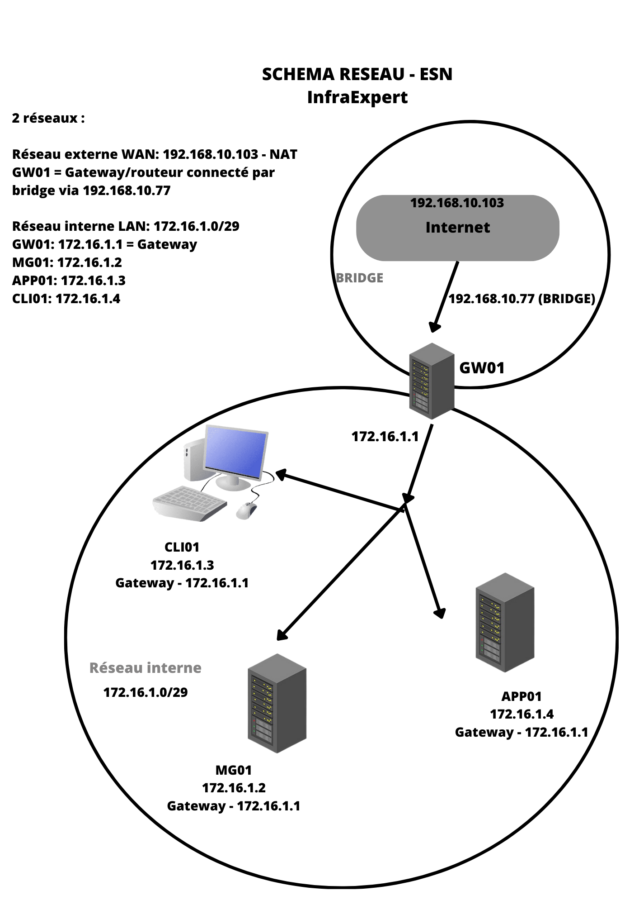
</p>

Explication schéma. 

On a donc deux réseaux. 
Le réseau externe WAN - 192.168.10.103.
Le réseau interne 172.16.1.0 connecté par le gateway GW01 et l'adresse ip 172.16.1.1 
Il est appelé enp0s8 sur la machine GW01.

Ici on a choisi un réseau /29 car on a que 4 équipement : GW01, CLI01, MG01, APP01.
https://jodies.de/ipcalc?host=172.16.1.0&mask1=29&mask2=

### Etape 2 : Mise en place de l'installation IPTABLES

Après avoir mis en place toutes les adresses ip nécessaires et avoir téléchargés iptables il faut permettre au bridge du gateway de connecter toutes les interfaces.

enp0s8 = réseau interne

enp0s3 = réseau externe

Pour mieux illustrer les commandes voici un statut de nos connections pour GW01. Avec enp0s3 la connection au réseau externe (192.168.10.77) et enp0s8 la connection au réseau interne (172.16.1.1). 

<p style="text-align: center">
  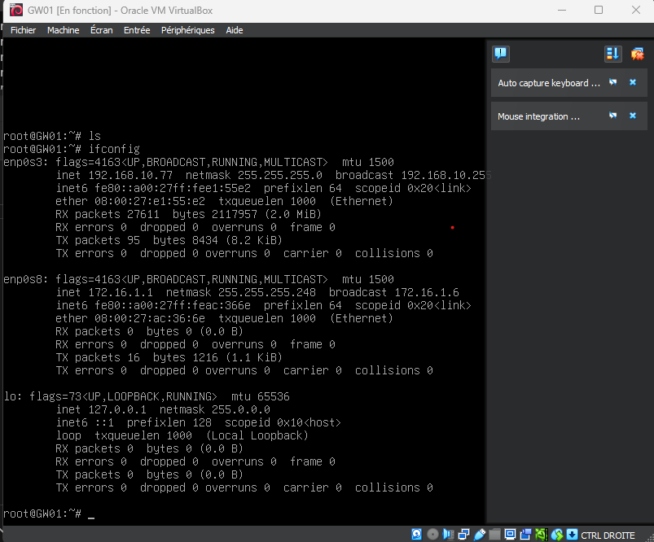
</p>

Vérifier les régles de forwarding. Elle doivent être mis à 1 pour la transmission de packet.  
```
nano /etc/sysctl.conf  
sudo sysctl -p /etc/sysctl.conf  
```
<p style="text-align: center">
  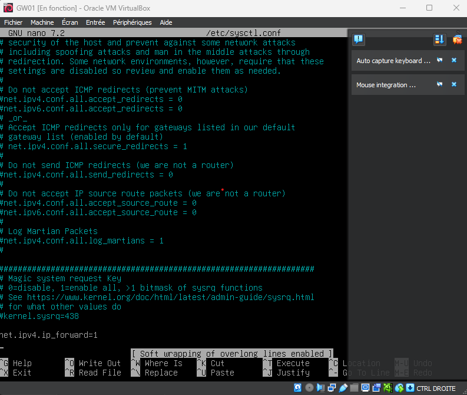
</p>

Ensuite il faut parametre toutes les interfaces réseaux de toutes les autres machines pour qu'elle puisse se connecter via le gateway.  

```
nano /etc/network/interfaces  
```

<p style="text-align: center">
  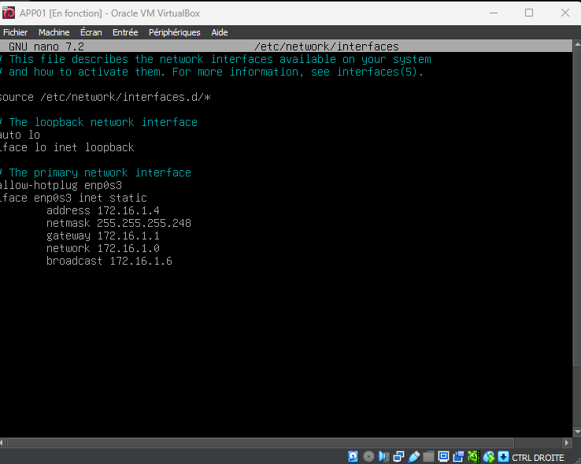
</p>


inbound packet reseau interne & outbound packet réseau externe 

Dans la machine GW01:  
```
iptables -A FORWARD -i enp0s8 -o enp0s3 -j ACCEPT 
iptables -t nat -A POSTROUTING -s 172.16.1.1/29 -o enp0s3 -j SNAT --to-source 192.168.10.77
iptables -t nat -A POSTROUTING -o enp0s3 -j MASQUERADE
```
Il est important de sauvegarder ces règles après avoir installer iptables-persistent 
```
sudo apt-get install iptables-persistent  
```
Et pour les sauvegarder dans un fichier qu'on appellera rules.v4.  
```
sudo su -c 'iptables-save > /etc/iptables/rules.v4'  
```

<p style="text-align: center">
  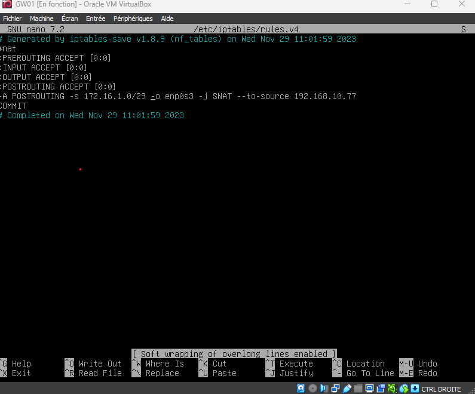
</p>

Pour setup la connection entre les machines. Et du coup le ping 8.8.8.8 dans toutes les machines est possible que quand la machine GW01 est connecté.

Ping machine GW01 allumé :  

<p style="text-align: center">
  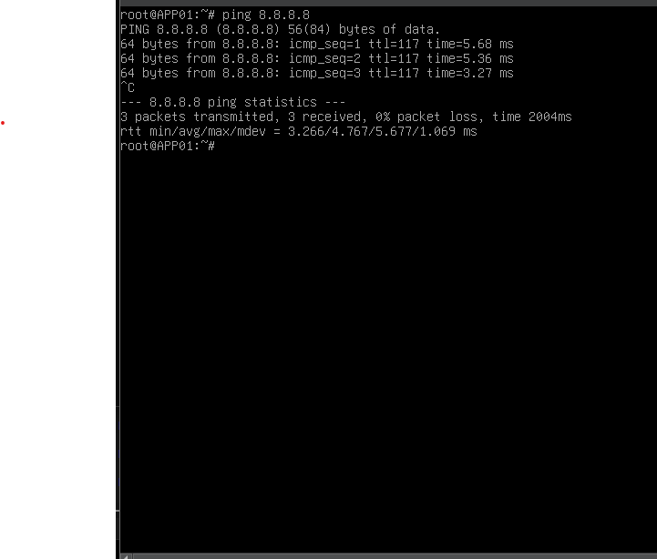
</p>

Ping machine GW01 éteinte :  

<p style="text-align: center">
  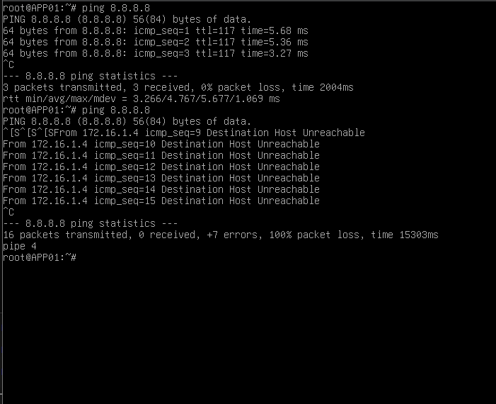
</p>

### Etape 3 : Mise en place du DNS

nano /etc/hostname

Sur chacune des machines en modifiant leur nom de domaine pour qu'elle corresponde au FQDN.

```
$@MG01> sudo apt-get update
$@MG01> sudo apt-get install -y bind9 
$@MG01> nano /etc/bind/named.conf.local
```

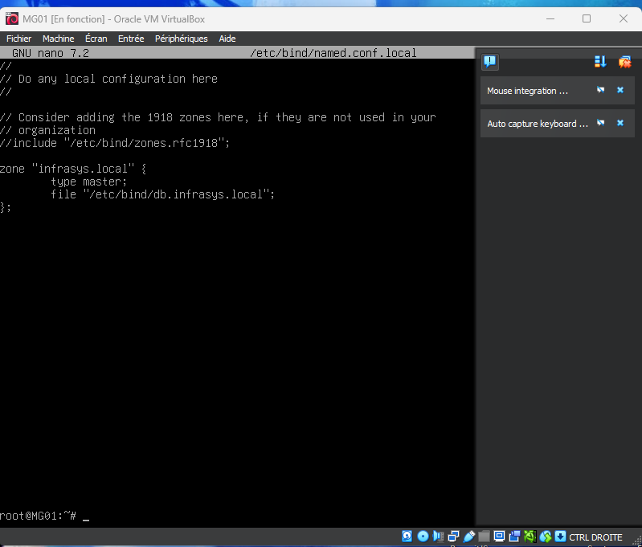

Il faut ensuite créer le fichier de zone pour MG01 qui est 'db.infrasys.local'.

```
$@MG01> nano /etc/bind/db.infrasys.local
```

Et le configurer comme ceci

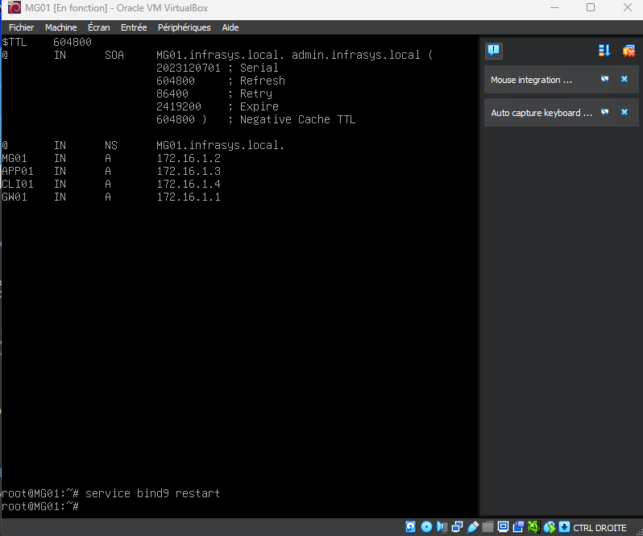

@ IN SOA MG01.infrasys.local.
@ représente le domaine racine. Cela signifie que ces paramètres s'appliquent à la zone entière.
IN spécifie la classe DNS, dans ce cas, Internet.
SOA est l'abréviation de Start of Authority, indiquant le début des informations d'autorité pour la zone.
TTL 604800:  
Il s'agit du Time to Live (TTL) par défaut pour tous les enregistrements dans ce fichier de zone. Le TTL spécifie la durée pendant laquelle les enregistrements DNS sont conservés en cache. Dans cet exemple, le TTL est défini à 604800 secondes, ce qui équivaut à une semaine.  
Serial : 2023120701
Serial correspond à la date de modification. Ici on va mettre 2023120701 car j'ai fait ça le 07 décembre.  
Refresh correspond à la fréquence à laquelle les serveurs esclaves demanderont une mise à jour à ce serveur. Dans cet exemple, c'est 604800 secondes, soit une semaine.  
Retry : 86400
Si un serveur esclave ne peut pas contacter le serveur principal lors d'une tentative de rafraîchissement, il attendra ce délai avant de réessayer. Ici, c'est 86400 secondes, soit un jour.  
Expire : 2419200  
Si un serveur esclave ne peut pas contacter le serveur principal pendant cette période, il considère ses données comme obsolètes. Ici, c'est 2419200 secondes, soit 28 jours.  
Negative Cache TTL : 604800  
Le TTL pour les enregistrements négatifs, c'est-à-dire la durée pendant laquelle un serveur DNS conserve en cache l'information selon laquelle un enregistrement n'existe pas. Dans cet exemple, c'est 604800 secondes, soit une semaine.  


Ensuite on restart le service bind9 pour que les configurations se mettent à jour

```
$@MG01> service bind9 restart
```

Il faut ensuite dans les autres machines mondifier le resolv.conf pour y ajouter l'adresse ip du serveur DNS MG01. 

```
$@APP01> nano /etc/resolv.conf
```

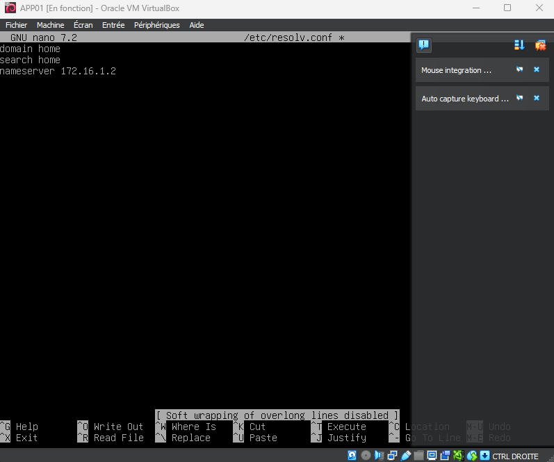

Après toutes les configurations mises en places/
On voit donc qu'il est possible de pinger MG01.infrasys.local depuis la machine APP01.

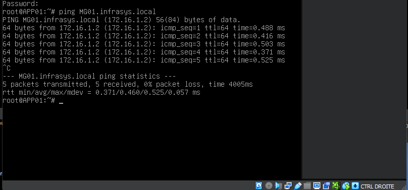  

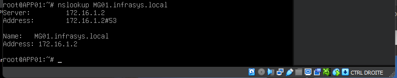


### Etape 4 : Mise en place du DHCP  

Pour mettre en place le DHCP sur MG01 il faut commencer par installer isc-dhcp-server. 

```
sudo apt-get install isc-dhcp-server
```

Ensuite il faut modifier le document dans le chemin '/etc/dhcp/dhcpd.conf" pour mettre en place le sous réseau par rapport aux paramètres qu'on a évoqué "dhcp", 
gateway 172.16.1.1 et le DNS 172.16.1.2.

Sans oublier de récuperer l'adress MAC de l'interface internet 172.16.1.3 d'APP01.  
  

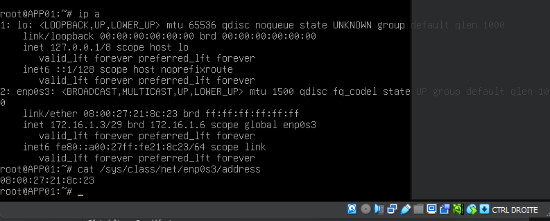

On réserve l'adresse IP d'app 01 dans le document comme renseigné graçe à son adresse MAC. (très sensible à la casse)  

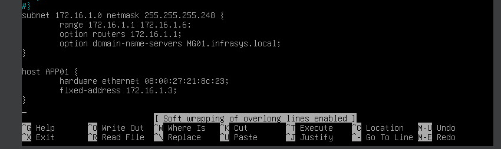

Il faut de plus ajouter une configuration Ipv6 dans mon cas car sinon le service exit et du coup iscp ne se démarre pas.  

Du coup on ajoute dans /etc/network/interfaces dans MG01
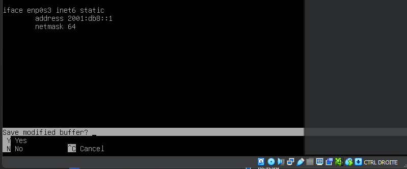  

Ensuite on ajoute dans dhcpd6.conf

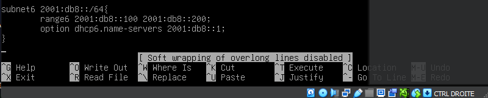

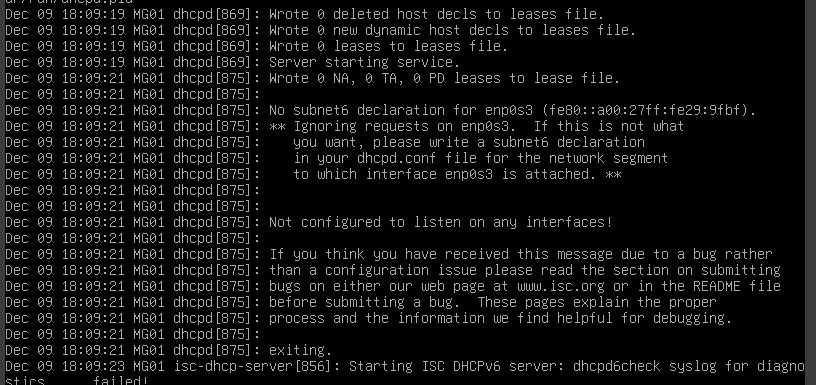

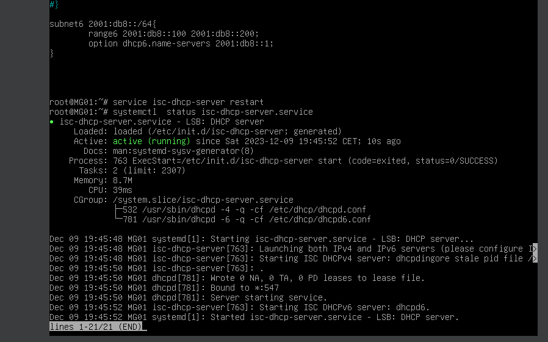

On teste en installant dhcping

```
sudo apt-get install dhcping  
```

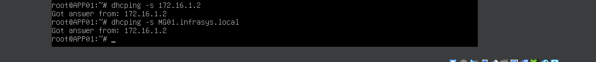

On obtient bien les réponses via dhcping.  

N'oubliez pas de mettre authoritative pour le serveur dhcp. 
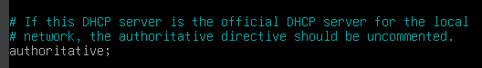

### Etape 5 : SSH

Pour setup le ssh entre MG01 et GW01 il faut tout simplement déja crée une clé ssh dans chacun des deux serveurs avec la commande : 

```
ssh-keygen -t rsa -b 4096
```

Une fois cela fait il faut copier l'id sur l'utilisateur des machines distantes avec la commande 

```
gateway@GW01:~$ ssh-copy-id manager@172.16.1.2  
manager@GW01:~$ ssh-copy-id gateway@172.16.1.1  
```

Ensuite il faut modifier le document sshd_config pour permettre la connection sans mot de passe et seulement via les paire de clés privée / public :  

```
sudo nano /etc/ssh/sshd_config
```


Ensuite on s'assure qu'on a le warning demandé par rapport à notre login / machine avec la commande :

```
sudo nano /etc/ssh/banner
```

On y créer le message de warning et on l'ajoute dans la config sshd

```
sudo nano /etc/ssh/sshd_config
```

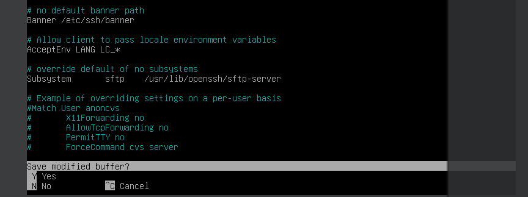

Et on voit que la banner s'affiche correctement pour les deux machines :

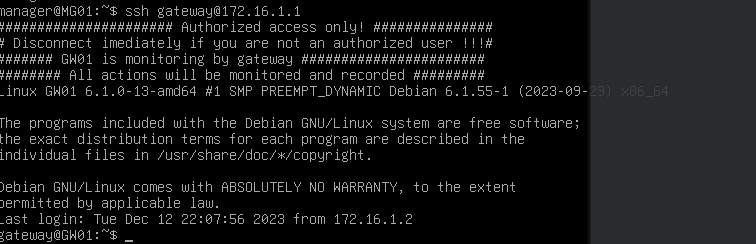

Ensuite il faudra sur GW01 créer les routes de PREROUTING via iptables : 
```
sudo iptables -t nat -A PREROUTING -p tcp --dport 2222 -j DNAT --to-destination 172.16.1.2:22 (mg01)
sudo iptables -t nat -A PREROUTING -p tcp --dport 2223 -j DNAT --to-destination 172.16.1.3:22 (app01)
```

On ajoute de plus les ports ssh d'écoute pour GW01 : 
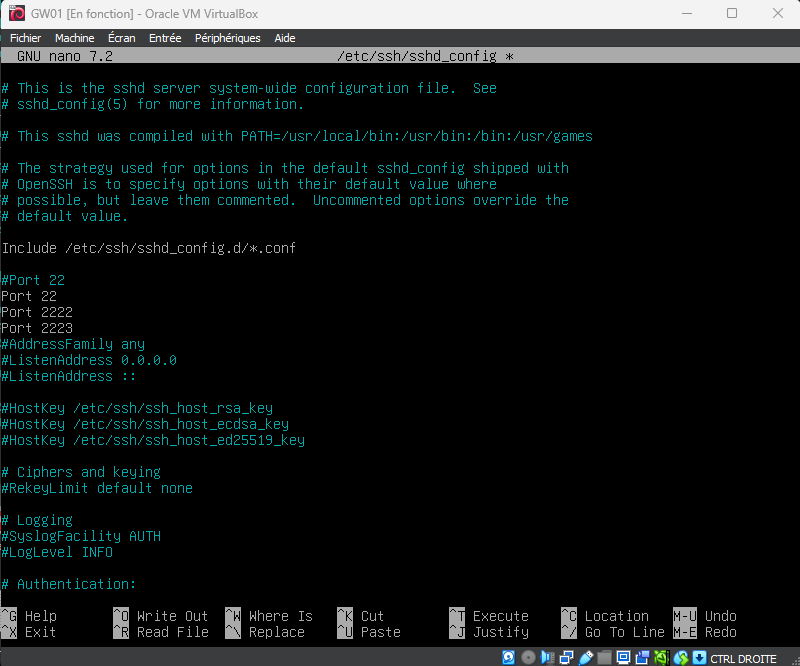